# Storyboard

## Introdução ao gênero Roguelike

_Roguelike_ trata-se de um subgênero de jogo derivado do RPG.
Nele o jogador controla um personagem, que pode variar de diversas maneiras, desde atributos variados gerando combinações quase únicas até uma gama mais limitada de personagens pre estabelecidos.
Neste modelo o personagem começa no início de uma _dungeon_ com recursos básicos, e o jogador deve avançar até o final derrotando monstros, possivelmente melhorando seu gear.
Os _Roguelike_ costumam seguir o padrão de _permadeath_, ou seja, uma vez que se morre o personagem é perdido e um novo deve ser criado, mas algumas vantagens podem ser obtidas ou desbloqueadas para a próxima _playthrough_.
Normalmente o jogo faz uso da ideia de _fog of war_, _dungeons_ são exploradas às cegas, o mapa não é conhecido e o jogador é limitado apenas ao que já viu naquela _playthrough_
A história em jogos Roguelike é contada de maneira rápida, simples e sutil, se comparado a outros derivados do RPG; o modelo é altamente focado no combate, upgrade e progresso pela _dungeon_.

Eis algumas importantes características comum aos jogos _Roguelike_:
(1) Mapas: A _dungeon_ são geradas aleatoriamente para cada _playthrough_, assim o jogador deve explora-la com cautela sempre que começa uma nova partida;
(2) _Permadeath_: Ao morrer o progresso do jogador pela _dungeon_ é perdido;
(3) Combate: O combate é obrigatório. Mesmo que possam ser encontrados alguns aliados no caminho, é impossível terminar o jogo sem fazer vários combates;
(4) Exploração: Explorar a _dungeon_ sempre vai trazer recompensas ao jogador, de maneira que simplesmente encontrar o _Boss_ final logo de início não seria tão interessante;
(5) Recursos: Recursos necessários costumam ser escaços, sejam eles uma tocha para ajudar a enxergar onde se pisa ou mesmo pontos de HP e Mana.

Algumas outras características são bem abertas e variam bastante entre jogos do gênero.
O combate, por exemplo, em jogos mais clássicos usavam combates por turno, enquanto hoje existem várias variações.
A temática também não é algo fixo, há jogos medievais, espaciais, fantasiosos entre outros.
Alguns são de plataforma, outros tem a visão 2d de cima da sala ou mesmo um _FPS_.
A dungeon pode ser algo tão extenso e difícil que realmente termina-la é quase impossível quando combinado a aleatoriedade de eventos e as mortes permanentes.
Alguns jogos tem características _Roguelike_ em parte do jogo mas não nele como um todo, afinal esse é um subgênero.

O jogo que propomos segue um estilo RPG _Roguelike_ em plataforma com temática medieval.
Ele possuirá três níveis cada um com algumas variações em temática e inimigos, ao longo da _dungeon_.
Caminhos serão gerados de maneira aleatória para cada partida, mas os _Boss_ ao fim de cada nível serão sempre os mesmos.
Em cada nível há diferentes desafios e segredos para o jogador adquirir e ajuda-lo na partida.
O jogador poderá adquirir equipamentos para melhorar seus atributos ao longo da _playthrough_, porém esses serão perdidos em caso de morte.
Por outro lado pontos de experiência também serão obtidos e podem ser utilizados para melhorar atributos do personagem que não serão perdidos.
Vencer o jogo deve ser um desafio a habilidade do jogador em derrotar os inimigos e não um desafio a sua sorte em percorrer um mapa aleatório.

## Lore

**Alanis** é uma gata paraplégica que mora sozinha com o seu tutor e ele à ajuda com todas as suas necessidades.

Num certo dia ele lê para ela um antigo conto.
Um corajoso cavaleiro havia perdido sua amada esposa e saiu numa missão de encontrar uma lendária esfera
que, segundo a lenda, pode conceder qualquer desejo a quem quer que a toque.
No conto, o bravo cavaleiro consegue a tão cobiçada esfera e consegue trazer de volta sua esposa.
Sabendo do poder que a esfera possui, o bravo cavaleiro a esconde no seu castelo, para que apenas
outros corajosos cavaleiros de puro coração possam encontra-la.

Depois de ouvir o conto **Alanis** adormece, e logo se encontra num sonho estranho.
Nele, ela é parte humana e pode andar, pular e correr assim como o bravo cavaleiro da história que ouvira.
Um **Mago** então aparece e pergunta se ela esta ali para tentar tocar a **Esfera dos Desejos**.
O **Mago** conta-lhe que há poderosas criaturas lá e que irão impedir que qualquer um entre no castelo.
Mas ele a oferece ajuda, entrega-lhe uma espada para que ela possa enfrentar os desafios que a aguarda
com a honra de uma brava cavaleira.

**Alanis** então adentra os jardins na entrada do castelo, enfrentando criatura após criatura, armadilha após armadilha.
Mas ela nunca foi preparada para aquilo, não é rápida e forte como o herói do conto lido pelo seu tutor,
e ela é eventualmente derrotada em combate.
Porém, mesmo com o impacto da última pancada que recebera ela não acorda, e se encontra novamente na entrada do jardim ao lado do **Mago**.

O **Mago** então pergunta-lhe se ela busca a **Esfera dos Desejos** novamente, como se não se lembrasse dela.
Ela parece ter voltado para o início do sonho.
Mas por fim o **Mago** diz algo diferente, ele afirma que sente uma grande força dentro dela, e que usando sua magina
ele pode torna-la mais poderosa.
A gata aceita a ajuda do **Mago** e parte para o castelo agora um pouco mais forte que antes.

A **Alanis** então se vê nesse ciclo de sempre retornar ao início do sonho ao ser derrotada,
mas sempre que tenta encontrar a esfera sente que conseguiu chegar um passo mais longe que antes.
Até que finalmente, no fundo das catacumbas do castelo ela chega a sala onde se encontra a **Esfera dos Desejos**.
Ela então corre em direção a esfera para que possa finalmente realizar seu desejo, mas é interrompida por uma estranha magia.
O **Mago** então afirma que ajudou a **Alanis** apenas para que ela encontrasse a esfera, mas que não pretendia deixar que ninguém
além dele realizasse desejos e começa a atacar a gata.
Mas a **Alanis** não é mais aquela gata despreparada e medrosa, ela agora é forte e ágil como o herói do conto que a inspirou.
Ela derrota o **Mago** traidor e prossegue para pegar à esfera.

Logo que a gata toca a **Esfera dos Desejos** ela acorda.
Seu tutor ainda dormindo numa poltrona com o livro fechado ao lado de seu assento, o fogo ainda queimando na lareira, a neve ainda caindo do lado de fora da casa, e ela deitada na sua cama no chão, como ficava a maior parte do tempo, como se apenas alguns minutos tivessem se passado.
Eis que a gata levanta, vai até o seu tutor, deita em seu colo e adormece novamente.

## Menu

O jogo possui duas telas de menu:  
  - Main Menu  
  - Esc Menu  

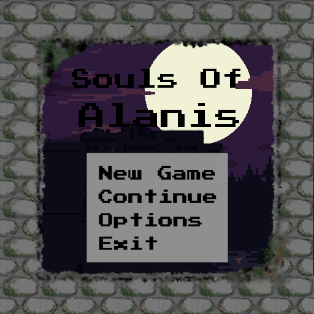  
O **Main Menu** é o apresentado no início de cada _playthrough_.  

Pelo fato de ser o primeiro menu que o jogador encontra, apresenta o a opção de **New Game** para começar um nova partida.  
Ao encerrar uma partida a mesma é salva e pode ser reiniciada pela opção de **Continue** no futuro.  
Neste menu o jogador tem acesso as funcionalidades de configuração do jogo (**Options**), como configuração da resolução, mapeamento de teclas, opções de som, etc.  
E por último a função de fechar o jogo.

  
O **Esc Menu** é o apresentado dentro de uma _playthrough_ toda vez que o jogador preciona a tecla _esc_.  
Esse menu compartilham algumas das opções disponiveís no **Main Menu**  

**Continue** tem a função de sair do menu. Jogador tem acesso as funcionalidades de configuração do jogo (**Options**), como configuração da resolução, mapeamento de teclas, opções de som, etc.  
E por último a opção **Exit** que salva o progresso (mantendo o _permadeath_) e fecha o jogo.  

## Personagem Principal, Alanis

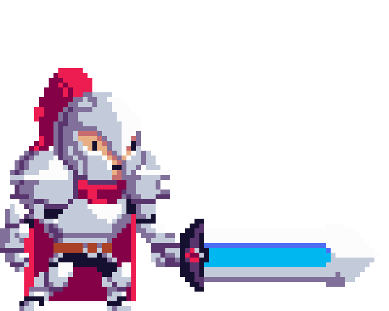

(Imagem não definitiva retirada do [Rougue-Legacy](http://www.cellardoorgames.com/roguelegacy/))

O personagem terá uma movimentação relativamente rápida, digna de qualquer felino.

Ações de movimentação do personagem:
- Andar
- Pular
- Saltar
- Atacar
- Escalar paredes

O personagem também poderá equipar diferentes itens que podem ser obtidos ao longo da _playthrough_, dentre eles temos:
- Armaduras
- Anéis
- Armas

Equipamentos são uma forma de alterar alguns atributos do personagem para aquela _playthrough_.
Uma forma de melhor os atributos permanentemente é aumentando o nível do personagem.

Ao longo de uma _playthrough_ o personagem acumulará pontos de experiência.
Ao começar uma nova partida, tendo pontos de experiência o suficiente,
o jogador poderá comprar novos níveis com o *Mago*.
Cada nível dá ao personagem um novo ponto para a árvore de talentos bem como um incremento nos atributos base.

O personagem terá uma árvore de talentos para cada tipo de arma disponível no jogo, podendo então distribuir livremente os pontos
que ganha para melhorar o uso de qualquer tipo de arma.
Com isso o personagem pode ficar mais forte a cada partida mas dentro do estilo de jogo que o jogador preferir.

Tipos de armas disponíveis:  

Espada | Lança | Machado
------ | ----- | -----
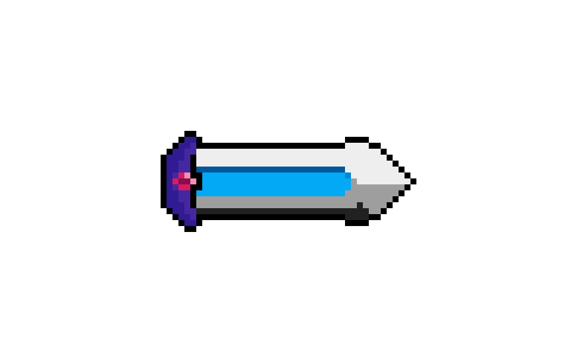 | 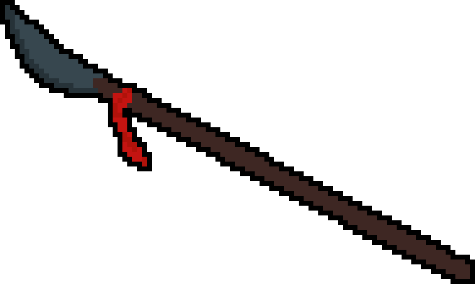 | 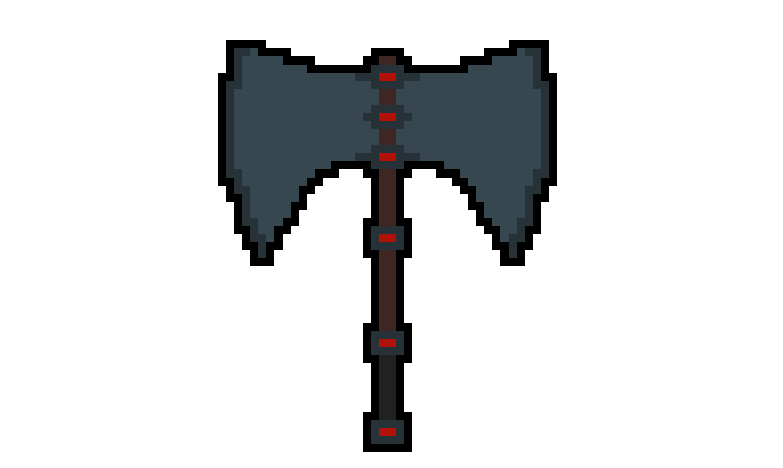

## Itens Consumíveis

Ao longo de sua jornada Alanis poderá vir a encontrar diversos objetos para auxiliarem em sua aventura, um tipo bastante comum a ser encontrado é os itens consumíveis. São itens onde a personagem ao encostar no objeto recupera uma quantia de HP, estamina ou adquiri um benefício temporário.

## HUD

Imagem da versão inicial do HUD:

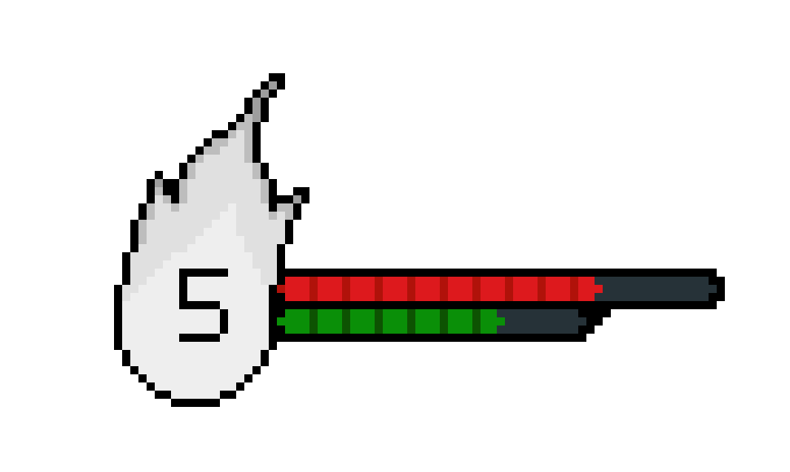

## Aliados e Inimigos

No jogo, a personagem principal se deparará com vários _**NPC**_(non-player characters - personagens não jogáveis). Determinados NPC só poderão ser encontrados em determinadas áreas do jogo. Além disso, medida que o jogador avança no jogo, NPC mais poderosos aparecerão.

 Os NPC serão divididos entre **Inimigos** e **Aliados**. Os inimigos serão aqueles que irão infringir dano a vida ou *stamina* jogador. Já os aliados serão aqueles que vão solicitar as **quests** e interagir com o *player*.

## Inimigos

  Os inimigos serão distribuídos de maneira estratégica dentro do jogo, onde, inimigos específicos e mais fortes aparecerão somente em determinadas fases do jogo. Cada fase terá 6 tipos de inimigos.

### Inimigos Comuns
- Os Inimigos Comuns serão aqueles inimigos que poderão aparecer em qualquer lugar do jogo.

- **Morcego**
  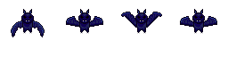
  - __Descrição__: Os morcegos comuns são inimigos com pouca vitalidade que causam pouco dano e geralmente morrem com apenas um ataque.

  - __Ataques__:
    - Mordida: o morcego avança e ataca o jogador se ele se aproximar.
  - __Movimentos__
    - Vôo: o morcego fica o tempo todo voando parado ou percorrendo alguma área do cenário.

- **Cavaleiro Guardião**
  
  - __Descrição__: Os cavaleiros guardiões são sempre inimigos mais fortes e podem ser encontrados em qualquer lugar do castelo.

  - __Ataques__
    - Golpe: O cavaleiro desfere um golpe com sua espada cobrindo uma pequena área a sua frente e parte superior.
    - Impulso: Este é o golpe mais forte onde o cavaleiro ataca com um impulso para frente cobrindo uma área maior.
  - __Movimentos__
    - Muralha: O cavaleiro se protege com sua espada e fica imune a danos.
    - Sentinela: Fica parado até que o jogador se aproxime e seja notado.
    - Ronda: O cavaleiro fica caminhando de um lado para outro até que o jogador se aproxime.

## Aliados

  Os aliados também serão divididos por fase e eles oferecerão desafios, recompensas ou troca/venda de itens.

## Fase 1 - Jardim

Uma arte conceitual para demonstração da ambientação da fase floresta.

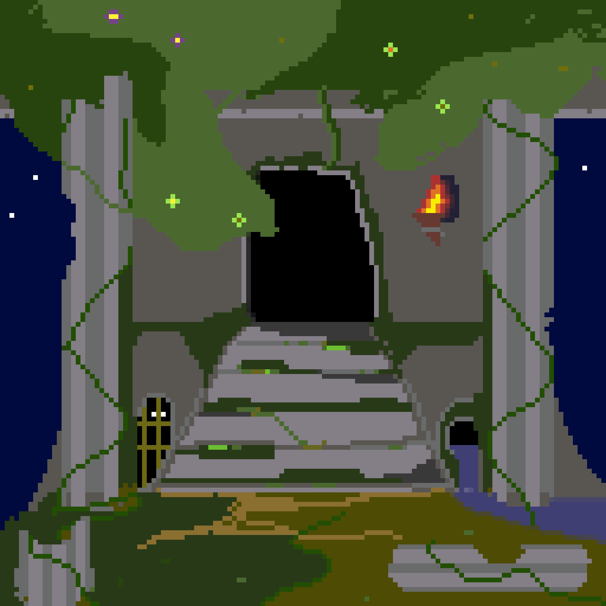

### Inimigos
- **Planta**
  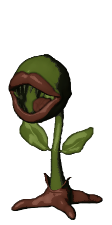
  - __Descrição__: Uma planta aparentemente inofensiva, até que você se aproxime dela!
  - __Ataques__:
     - Pétala: a flor ataca o inimigo com um golpe fraco.
     - Espinho: a flor ataca o inimigo com um golpe médio.
  - __Movimentos__:
     - Sentinela: Fica parada até que o jogador se aproxime e seja notado.

- **Cogumelo**
  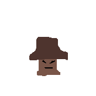
  - __Descrição__: Um cogumelo inofensivo. Pode ser derrotado com um ataque ou apenas pulando em cima. Causa dano ao encostar suas toxinas no jogador.
  - __Movimentos__:
    - Caminhada: O cogumelo caminha de um lado para o outro no cenário.

- **Porco-espinho**
  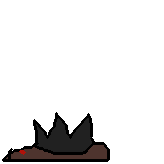
  - __Descrição__: Um pequeno animal coberto por espinhos que causam dano ao jogador.
  - __Movimentos__:
    - Caminhada: O porco-espinho caminha de um lado para o outro no cenário.

- **Gnomo**
  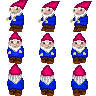
  - __Descrição__: Um gnomo guardião que ajuda a proteger o castelo.
  - __Ataques__:
    - Soco: O gnomo desfere um golpe se o jogador estiver perto o suficiente.
    - Disparo: O gnomo dispara pequenas bombas que dão dano em área.
  - __Movimentos__:
    - Sentinela: Fica parado até que o jogador se aproxime e seja notado.
    - Ronda: O gnomo fica caminhando de um lado para outro até que o jogador se aproxime.

### Aliados
- **O Mago**
  - __Descrição__: O Mago é o Sábio que fica na porta do Jardim e é o primeiro NPC com o qual o jogador interage. Com o mago é possível trocar as almas coletadas por pontos de experiência e habilidades.

- **Unicórnio**
  
  - __Descrição__: O Unicórnio, à primeira vista é apenas um cavalo normal. Mas se o jogador usar o Cogumelo Roxo encontrado no Jardim ele desbloqueia a _quest_ do Unicórnio e consegue interagir com o mesmo.

### _BOSS_
- **Fauno**
  - __Descrição__: O guardião dos jardins do castelo.
  - __Ataques__:
    - Golpe: O Fauno ataca em uma grande área vertical com sua alabarda.
    - Impulso: O Fauno ataca com a alabarda como se fosse uma lança atravessando o campo de batalha.
    - Sopro: O Fauno sopra e empurra o jogador para longe.
    - Salto: O Fauno salta cenário e cai em outro ponto.
  - __Movimentos__:
    - Corrida: O Fauno corre de um lado para o outro da tela.

## Fase 2 - Castelo
### Inimigos
- **Armadura-sem-cabeça**
  - __Descrição__: Uma armadura pesada que ganha vida e ataca o jogador.
  - __Ataques__:
    - Golpe: Desfere um golpe com sua lança cobrindo uma pequena área a sua frente.
    - Impulso: Este é o golpe mais forte onde a armadura ataca com um impulso para frente cobrindo uma área maior.
  - __Movimentos__:
    - Muralha: Armadura se protege com seu escudo e fica imune a danos.
    - Sentinela: Fica parada até que o jogador se aproxime e seja notado.

- **Serpente**
  - __Descrição__: Uma ágil serpente que pode infringir dano considerável ao jogador.
  - __Ataques__:
    - Impulso: A serpente dá um bote na direção do jogador e ataca com as presas.
    - Disparo: A serpente dispara uma rajada de veneno de suas presas na direção do jogador.
  - __Movimentos__:
    - Corrida: Se move em uma direção muito rapidamente.
    - Sentinela: A serpente fica parada em pé até que o jogador se aproxime e seja notado.

### Aliados
- **Outro Gato**
  - __Descrição__: Um gato mosqueteiro que pode ser encontrado dentro do castelo e oferece desafios e recompensas.
- **Andre**
  - __Descrição__: Um homem corpulento que sabe lidar com uma forja e brandir um pesado martelo. Pode vender equipamentos.

### _BOSS_
- **Beholder**
  - __Descrição___: O "vigia" do castelo que guarda a entrada da Cripta.
  - __Ataques__:
    - Disparo: uma rajada de disparos mágicos saem do olho do Beholder.
    - Lacaios: Beholder invoca goblins.
    - Teletransporte: Beholder pode se teletransportar para onde o jogador está, infringindo dano.
  - __Movimentos__:
    - Vôo: O Beholder é capaz de voar pelo cenário.

## Fase 3 - Cripta
### Inimigos
- **Fantasma**
  
  - __Descrição__: Os fantasmas são almas penadas com a habilidade de atravessar paredes e não são afetados por ataques comuns.
  - __Movimentos__:
    - Vôo especial: os fantasmas podem voar em qualquer direção ignorando qualquer parede ou objeto.

- **Esqueleto**
  
  - __Descrição__: Os esqueletos podem ser derrotados facilmente, mas causam dano alto.
  - __Ataques__:
    - Golpe: Desfere um golpe com sua espada cobrindo uma pequena área a sua frente.
    - Impulso: Este é o golpe mais forte onde o esqueleto ataca com um impulso para frente cobrindo uma área maior.
    - Disparo: Esqueletos podem ter um arco e disparar flechas à distância.
  - __Movimentos__:
    - Sentinela: O esqueleto fica parado até que o jogador se aproxime e seja notado.
    - Ronda: Fica caminhando de um lado para outro até que o jogador se aproxime.

- **Aranha**
  - __Descrição__: As aranhas podem estar grudadas nos telhados ou paredes.
  - __Ataques__:
    - Golpe: Desfere um golpe com suas presas cobrindo uma pequena área a sua frente.
    - Disparo: Dispara teia no jogador.
  - __Movimentos__:
    - Salto: As aranhas saltam de onde estão e podem alternar entre paredes.
    - Ronda: Fica caminhando de um lado para outro até que o jogador se aproxime.

- **Múmia**
  - __Descrição__: As múmias são as criaturas mais fortes da cripta. Possui alto dano e vitalidade.
  - __Ataques__:
    - Golpe: Desfere um golpe com suas ataduras putrefatas cobrindo uma pequena área a sua frente.
    - Golpe longo: a múmia estica suas ataduras em qualquer direção cobrindo uma grande área.
  - __Movimentos__:
    - Sentinela: A Múmia fica parada até que o jogador se aproxime e seja notado.
    - Ronda: Fica caminhando de um lado para outro até que o jogador se aproxime.

### Aliados
- **Fantasma Bill**
  - __Descrição__: O Fantasma Bill oferece desafios e uma das recompensas é a habilidade de atacar fantasmas.

### _BOSS_
- **O Mago**
  - __Descrição__: O Mago é o _boss_ mais poderoso do jogo.
  - __Ataques__:
    - Golpe: Mago desfere um golpe curto com seu cajado.
    - Disparo: Mago dispara rajadas de magia.
    - Lacaios: O Mago é capaz de invocar esqueletos.
    - Teletransporte: Pode se teletransportar para onde o jogador está, infringindo dano.
    - Tormenta: Mago conjura raios que passam da margem superior à inferior do cenário.
  - __Movimentos__:
    - Caminhada: Pode se mover de um lado ao outro do cenário.

## Salas e Seus tipos

O jogo possuí diferentes tipos de salas assim como diferentes tamanhos de salas. Referente aos tamanhos, existem quatro:

- Grande
- Média
- Campo de visão do personagem
- Corredor

Esses tamanhos podem ser misturados com os tipos de salas presentes no jogo, sendo elas:

## Sala Desafio
   Sala onde o jogador deverá cumprir um determinado desafio para ganhar uma recompensa. Esses desafios podem variar de matar uma quantidade de monstros, não poder usar a ação de atacar, não poder pular, não receber qualquer tipo de dano e etc. O tamanho dessa sala varia entre grande, médio e campo de visão do personagem. Podendo ou não ter inimigos assim como objetos de interação(coisas para quebrar e etc).

## Sala de Conexão
   Sala de conexão com as outras salas, podendo ter orientação de saída ou entrada para direita, esquerda, cima, baixo ou todas elas ao mesmo tempo. Pode haver inimigos assim como objetos de interação. Tamanhos variando entre médio, corredor e campo de visão do personagem.

## Sala de Espólios
  Sala onde o jogador receberá uma recompensa ao final da sala. Podendo ter tamanhos variados entre médio, grande ou tamanho tela de visão. Podendo haver ou não inimigos, bem como objetos de interação.

## Sala de Chefe
  Sala onde o jogador enfrentará um determinado chefe ao final de cada fase, onde essa sala não possuí inimigos(a não ser inimigos invocados pelo próprio chefe) pode ou não possuir objetos de interação e o tamanho da sala varia de chefe para chefe, não tendo um tamanho a ser fixado.

## Sala Ordinária
  Sala comum onde o jogador pode encontrar inimigos para serem derrotados e objetos para interagir. Podendo variar seus tamanhos de médio, grande e campo de visão do personagem.

## Sala de Missão
   Sala onde o jogador irá encontrar um NPC que irá lhe fornecer uma missão, e após completar receberá uma recompensa. Os tipos de missões oferecidas por esses NPC são:
   - Caçada: onde o jogador precisa derrotar uma quantidade determinada de criaturas.
   - Coleta de itens: onde o jogador precisa coletar um item requerido pelo NPC.

Essa sala possuí tamanho fixo de tamanho tela de visão. A sala não possuí inimigos nem objetos de interação.

## Cronograma e Divisão das atividades
- Legenda
	- Jonathas "Thatox" Conceicao - T
	- Juan "Asaki" Rios - A
	- Lucas Bretana - B
	- Felipe "OneEyedAesir" Gruendemann -  O

- 07/05 - 14/05
	- Discutir o modelo de RPG
	- Discutir disposição das salas
	- Discutir disposição de mobs nas salas
	- Discutir upgrades (Main Character e Criaturas)
	- Discutir bônus dos itens

- 07/05 - 28/05
	- Personagem Principal => T
	- Inimigos normais => O
		- Jardim
		- Castelo
		- Cripta
	- Armas => T
		- Espada
		- Lança
		- Machado
	- Geração do mapa => A
	- Salas => A & B
		- Tamanho tela
		- Sala Longa
	- Tipos de sala => A & B
		- Salas ordinárias
		- Sala inicial
		- Sala de pilhagem
		- Sala de corredor
	- Main Menu & Esc Menu => B
	- HUD => A
	- Alpha 0.1 - 28/05

- 28/05 - 25/06
	- Main Bosses
		- Fauno
		- Beholder
		- Mago
	- Sistema de upgrade
		- Personagem
		- Itens
		- Criaturas
	- Equipamentos
		- Armaduras
		- Anéis
	- NPCs aliados
		- NPCs das Quests
		- Mago
	- Salas
		- Tamanho 3
		- Tamanho 4
	- Tipos de sala
		- Sala de desafio
		- Sala de Boss
		- Sala de missão
	- Disposição das salas
	- Menu de inventário
	- Alpha 0.2 - 25/06

- 25/06 - 16/07
	- Entrada
	- Encerramento
	- Itens consumíveis
	- Mini bosses
		- Jardim
		- Castelo
		- Cripta
	- Disposição dos itens nas salas
	- Disposição dos inimigos nas salas
	- Beta 0.3 - 09/07
	- Final 1.0 - 16/07
